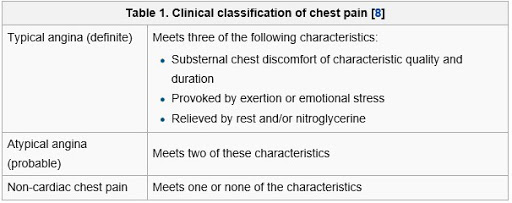

```{r setup, include=FALSE}
knitr::opts_chunk$set(echo = TRUE)
library(ggplot2)
```

## Introduction

For this project I am looking to try and predict the likelihood of hospital patients getting heart disease. For this I am using a heart disease data set consisting of four hospital databases from Cleveland, Hungary, Switzerland, and VA Long Beach. The domain is the patients who's records are contained within this data set. I thought this would be an interesting topic because heath is something that is generally important to everyone and heart disease is the number one cause of death globally. The ability for early detection is important to those at risk of cardiovascular disease.

## Data Set

I first found my data set on kaggle, but then found that its original source is a Heart Disease Data Set from UCI used for machine learning. The data is made up of public health data from Cleveland, Hungary, Switzerland, and VA Long Beach's databases. This data was collected by these hospitals for patient record and is therefore credible.

```{r data}
heart <- read.csv("heart.csv")

heart$target[heart$target == 1] <- "Unhealthy" # For clarification
heart$target[heart$target == 0] <- "Healthy"
heart$sex[heart$sex == 1] <- "Male"
heart$sex[heart$sex == 0] <- "Female"

head(heart)
```

* `age` - `integer` - the age of the patient in years.
* `sex` - `integer` - a categorical variable for the sex of the patient. (male; female)
* `cp` - `integer` - a categorical variable for chest pain type. (1 = typical angina; 2 = atypical angina; 3 = non-anginal pain; 4 = asymptomatic)
  + Angina is a condition marked by severe pain in the chest, often also spreading to the shoulders, arms, and neck, caused by an inadequate blood supply to the heart.
  + 
* `trestbps` - `integer` - resting blood pressure (in mm Hg on admission to the hospital)
* `chol` - `integer` - serum cholesterol in mg/dl
* `fbs` - `integer` - categorical variable for fasting blood sugar > 120 mg/dl (1 = true; 0 = false)
  + A test done on an empty stomach to determine how much glucose is in a blood sample. This test is often used to detect diabetes.
  + A fasting blood sugar level less than 100 mg/dL is normal
  + A fasting blood sugar level from 100 to 125 mg/dL is considered prediabetes
  + If it's 126 mg/dL or higher on two separate tests, you have diabetes
* `restecg` - `ordinal` - categorical variable for resting electrocardiographic results. (0 = normal; 1 = having ST-T wave abnormality; 2 = showing probable or definite left ventricular hypertrophy)
  + The most important cause of ST segment abnormality is myocardial ischaemia or infarction. Myocardial ischemia occurs when blood flow to your heart is reduced, preventing the heart muscle from receiving enough oxygen.
  + Left ventricular hypertrophy is enlargement and thickening (hypertrophy) of the walls of your heart's main pumping chamber (left ventricle).
* `thalach` - `integer` - maximum heart rate achieved
* `exang` - `integer` - a categorical variable for exercise induced angina (1 = yes; 0 = no)
  + Stable angina is usually triggered by physical activity.
* `oldpeak` - `double` - ST depression induced by exercise relative to rest
  + ST depression refers to a finding on an electrocardiogram, wherein the trace in the ST segment is abnormally low below the baseline.
  + In a cardiac stress test, an ST depression of at least 1 mm after adenosine administration indicates a reversible ischaemia, while an exercise stress test requires an ST depression of at least 2 mm to significantly indicate reversible ischaemia.
* `slope` - `integer` - the slope of the peak exercise ST segment
* `ca` - `integer` - number of major vessels (0-3) colored by flourosopy
  + Fluoroscopy is used to help the healthcare provider see the flow of blood through the coronary arteries to check for arterial blockages
* `thal` - `integer` - thalassemia (3 = normal; 6 = fixed defect; 7 = reversible defect)
  + Thalassemia is an inherited blood disorder that causes your body to have less hemoglobin than normal. Hemoglobin enables red blood cells to carry oxygen. Thalassemia can cause anemia, leaving you fatigued
* `target` - `integer` - diagnosis of heart disease (healthy = no disease; unhealthy = disease)

## Exploratory Data Analysis

```{r eda}
summary(heart)
```

### Heathly vs Unheathy Heart

```{r eda0}
ggplot(aes(target, fill=target), data=heart) +
  geom_bar()+
  geom_text(aes(label=stat(count)), stat='count', vjust=1.6, color="white", size=3.5)
```

A little over half of the patients in the data set have identified heart disease.

### chol: Cholesterol in mg/dl

```{r eda1}
ggplot(aes(chol, fill=target), data=heart) +
  geom_density(alpha = .7)
```

When comparing the distribution of cholesterol of patients with healthy vs unhealthy hearts we can see that most patients with heart disease are are concentrated around 150 mg/dl to 250 mg/dl, while patients without have a larger distribution with most concentrated around 250 mg/dl to 350/dl. One thing to note is that patients with heart disease's distribution has much more of a right skew then healthy patients. This may be useful when predicting if patients are at risk of heart disease.

### trestbps: Resting Blood Pressure

```{r eda2}
ggplot(aes(trestbps, fill=target), data=heart) +
  geom_density(alpha = .7)
```

The distribution of resting blood pressure of patients with healthy vs unhealthy hearts is rather similar suggesting that resting blood pressure may not be a good factor when predicting heart disease.

### thalach: Maximum Heart Rate Achieved

```{r eda3}
ggplot(aes(thalach, fill=target), data=heart) +
  geom_density(alpha = .7)
```
When looking at the distribution of maximum heart rate achieved by patients with healthy vs unhealthy hearts we can see that patients with unhealthy hearts are more likely to achieve higher maximum heart rates. Unhealthy patients distribution is more left skewed with the majority concentrated on the high end, while healthy patients have a more normal distribution. Maximum heart rate achieved may be a useful factor when predicting heart disease.


### oldpeak: ST depression induced by exercise relative to rest

```{r eda4}
ggplot(aes(oldpeak, fill=target), data=heart) +
  geom_density(alpha = .7)
```

The distribution of oldpeak in healthy vs unhealthy hearts are quite different. Patients with unhealthy hearts distribution appears to be exponential with most patients having an oldpeak of around 0, while healthy patients are more distributed. Oldpeak appears it may prove to be useful when predicting heart disease.

### cp: Chest Pain Experienced
(0 = typical angina; 1 = atypical angina; 2 = non-anginal pain; 3 = asymptomatic)

```{r eda5}
ggplot(aes(cp, fill=target), data=heart) +
  geom_bar(position = "dodge")
```

From the bar chart we can see that patients with healthy hearts are most likely to have typical angina while patients with heart disease are more evenly distributed among the chest pain types. This may come in hand when predicting heart disease.

### exang: Exercise Induced Angina
(1 = yes; 0 = no)

```{r eda6}
ggplot(aes(factor(exang), fill=target), data=heart) +
  geom_bar(position = "dodge")
```

From this bar chart we can see that patients without heart disease are more likely to have exercise induced angina, while patients with heart disease are slightly more likely to not, while being more evenly distributed. This also may be useful when trying to predict heart disease.

## Data Science Questions

My main data science question is if it is possible to predict the likelihood of a patient getting heart disease. In order to answer this I first have to figure out what some of the factors of heart disease are. I looked into this in my data exploration leading me to ask if cholesterol, maximum heart rate achieved, oldpeak, chest pain level, and exercise induced angina are predicting factors of heart disease. If so, can these factors be using in a modal that is then able to predict the risk of heart disease in patients?

The solution to to this problem would have a positive impact on our society. Heart disease is the number one cause of death world wide, so being able to predict it in individuals would go a long way to reduce possible deaths on a global scale.
